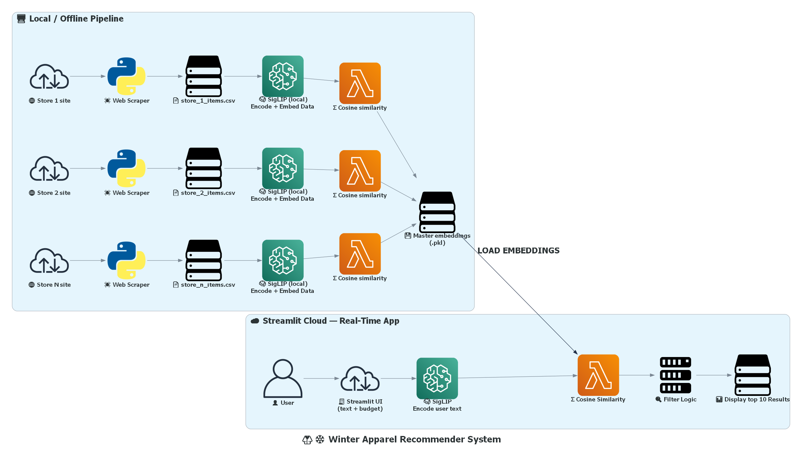

# 🧥❄️ Winter Apparel Recommender System  

> **COZY (Comfy Outfits Zoned for You)** to jointly encode text and images into a shared embedding space. Users describe what they're looking for, set a price budget, and receive the top 10 most relevant clothing items — all in real time via a Streamlit app.

## 💡 Purpose

This project was developed to help my sister prepare for winter, as she currently has limited warm outerwear suitable for both **work** and **casual** settings. Instead of spending time browsing multiple retailer websites — each with inconsistent product naming, page layouts, and filtering tools, I built a single interface that searches across stores and returns the most relevant items based on a natural-language description of what she needs.

Beyond solving a personal need, this project also served as a hands-on exploration of **multimodal representation learning**. It uses **SigLIP** — a vision-language model that embeds text and images into a shared latent space — to generate **dense vector embeddings** for both product listings and user queries. Recommendations are then ranked using **cosine similarity** over these embeddings, making it a clear example of **content-based filtering** without relying on user history, purchase data, or explicit ratings. Because the catalogue is built from **live-scraped listings**, the results stay aligned with what’s actually available and at what price, rather than depending on static datasets.

## 🚀 Live Demo
View the recommender system in action: 
**[Experience COZY ✨](https://comfy-outfits-zoned-for-you.streamlit.app/)**

## 📌 Table of Contents

- [Overview](#overview)
- [How It Works](#how-it-works)
  - [System Flowchart](#-system-flowchart)
  - [Part 1 — Data Ingestion & Embedding (Offline)](#part-1--data-ingestion--embedding-offline)
  - [Part 2 — Real-Time Recommendation (Streamlit App)](#part-2--real-time-recommendation-streamlit-app)
- [Tech Stack](#tech-stack)
- [Project Structure](#project-structure)
- [Getting Started](#getting-started)
  - [Prerequisites](#prerequisites)
  - [Installation](#installation)
  - [Running the App](#running-the-app)
- [Usage](#usage)

## Overview

This project is a **multimodal content-based recommender system** for winter clothing items (specifically **knitwear** such as **jumpers, sweaters, and sweatshirts**). Unlike collaborative filtering approaches, it requires **no user history** — recommendations are driven entirely by the semantic and visual similarity between a user's text query and the scraped product catalogue.

Key characteristics:

- **No cold-start problem** — works immediately with newly scraped items.
- **Scales dynamically** — as more products are scraped, the recommendation pool grows without retraining.
- **Multimodal understanding** — captures both visual style (from product images) and semantic meaning (from text descriptions) using SigLIP.

## How It Works

### 🔄 System Flowchart



### Part 1 — Data Ingestion & Embedding (Offline)

This is the **batch / offline** stage that prepares the data before any user interacts with the app. It follows an **iterative per-site cycle**:

For **each** e-commerce site:

1. **Scrape clothing data** — collecting item name/description, price, and image URL.
2. **Save** the scraped data as its own CSV file.
3. **Encode & embed** every item in that CSV using the local SigLIP model:
    - Text fields (item name/description) → text embedding
    - Product image → image embedding
4. **Save embeddings as a `.pkl` file** — pickle format is used instead of CSV to retain the original tensor format of individual embedding values.
5. **Test with cosine similarity** — pass a sample user preference into the cosine similarity function as a sanity check to verify embeddings are working correctly.
6. **Append** the newly embedded data to the **master Pickle file**.

This cycle repeats for every new site scraped. The master Pickle file **grows incrementally** — each new site's data is encoded, validated, and added on top of what already exists.

> The SigLIP model is downloaded once locally and reused across all sites. No retraining is ever needed — only re-running the encode → test → append cycle for new data.

### Part 2 — Real-Time Recommendation (Streamlit App)

This is the **online / real-time** stage that the end user interacts with.

1. The user opens the Streamlit app and enters:
- **Style preferences** — a free-text description (e.g. *"black waterproof puffer jacket"*)
- **Price budget** — easily adjustable increment and decrement buttons.
2. The app **encodes and embeds the user's text** using the same local SigLIP model.
3. **Cosine similarity** is computed between text embedding derived from the text provided by the user and every item embedding in the master Pickle file.
4. Results are **filtered** by the price entered by the user.
5. The **top 10 most similar items** are displayed in a dataframe on the UI.

Each new query triggers a fresh encode + embed → similarity → filter → display cycle in real time.

## Tech Stack

| Component | Technology |
|---|---|
| Embedding model | [SigLIP](https://huggingface.co/google/siglip-base-patch16-224) (local) |
| Similarity metric | Cosine similarity |
| Frontend | [Streamlit](https://streamlit.io/) |
| Data handling | Pandas |
| Scraping | BeautifulSoup + Selenium |
| Language | Python 3.10+ |


## Project Structure
```text
├── .gitignore
├── .streamlit/
│   └── config.toml                 # Streamlit theme configuration
├── data/
│   ├── raw/                        # Individual scraped CSVs per site
│   │   ├── ally_items.csv
│   │   ├── Muji_items.csv
│   │   ├── nike_items.csv
│   │   └── uniqlo_items.csv
│   └── embeddings/
│       ├── all_embeddings.pkl      # Concatenated master file with text and image embeddings
│       ├── ally_embeddings.pkl
│       ├── Muji_embeddings.pkl
│       ├── nike_embeddings.pkl
│       └── uniqlo_embeddings.pkl
├── docs/
│   └── workflow.png                # System/workflow diagram image
├── web_scraper.py                  # WebScraper class for scraping clothing stores
├── vector_encoder.py               # SigLIP model loading, encoding, embedding & cosine similarity functions
├── main.py                         # Orchestrates scraping and encoding pipeline
├── app.py                          # Streamlit app
├── generate_flowchart.py           # Generates a flowchart of the entire recommender system workflow            
├── requirements.txt
└── README.md
```

## Getting Started

### Prerequisites

- Python 3.10 or higher
- pip
- (Optional) A virtual environment manager

### Installation

```bash
# 1. Clone the repository
git clone https://github.com/nonDuck3/cozy-recommender.git
cd cozy-recommender

# 2. Create and activate a virtual environment
python -m venv venv
venv\Scripts\activate        # Windows
# source venv/bin/activate   # Mac / Linux

# 3. Install dependencies
pip install -r requirements.txt
```

### Running the App

```bash
# Run the full pipeline (scraping + encoding and embedding + compute cosine similarity) via main.py
# Use --help to see all available argparse options
python main.py --help

# Example: scrape a specific site and generate embeddings
python main.py "https://www.uniqlo.com/au/en/women/knitwear" "uniqlo" "C:/Users/msedgedriver.exe" "./siglip_local" "red wool turtleneck" --df_col "Clothing" --max_price 80

# Launch the Streamlit recommender
streamlit run app.py
```

## Usage

1. Open the Streamlit app in your browser (defaults to `http://localhost:8501`).
2. Type your style preferences into the text box (e.g. *"oversized wool coat, neutral tones"*).
3. Set your budget using the increment/decrement buttons or by typing a value directly into the price field.
4. Click **Search**.
5. View the top 10 recommended items displayed in a dataframe, ranked by similarity score.
